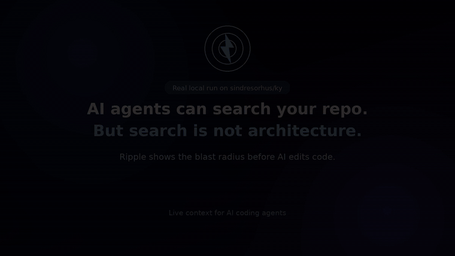

# ↯ Ripple — Live Local Context for AI Coding Agents

> AI coding agents can search your codebase.
> Ripple helps them understand what a change may affect before they edit.

Claude Code, Cursor, Copilot, Codex, and other AI coding agents are powerful.

But in real JavaScript and TypeScript projects, agents still operate with incomplete architectural awareness.

They can search files.

They can read symbols.

They can generate code.

But before editing a shared utility, service, hook, SDK function, or public API, agents still need live local context:

- What imports this file?
- What depends on it?
- Which functions have many callers?
- Is this file safe to edit?
- What is the likely blast radius?
- Should the agent continue, inspect callers first, or stop and ask for confirmation?

Ripple generates that context automatically.

It scans your workspace locally and builds live architectural context for AI agents:

- dependency signals
- caller counts
- blast-radius awareness
- risk guidance
- workflow instructions
- architectural history

So agents can make safer decisions before changing code.

---

## Concrete Example — `sindresorhus/ky`

🎥 Full Demo (real local run on `sindresorhus/ky`)
**Watch the demo:** [raushankcode.github.io/ripple/demo-video.mp4](https://raushankcode.github.io/ripple/demo-video.mp4)



Ripple was validated on a local clone of the open-source `sindresorhus/ky` TypeScript project.

```txt
52 files scanned
103 symbols found
349 import edges
41 call edges
```

For the same temporary change to:

```txt
source/utils/merge.ts::mergeHeaders
```

Manual search found:

```txt
2 direct text-match files
```

Ripple identified:

```txt
19 potentially impacted files
```

Ripple also:

- marked the change as `dangerous`
- surfaced caller context such as `cloneShallow()`
- recorded the exact symbol as `symbol_modified`
- generated workflow guidance for the AI agent
- surfaced verification targets before shipping the edit

This does **not** mean Ripple “understands everything.”

It means something more practical:

> Before an AI agent edits a risky file, Ripple surfaces local architectural signals that are easy to miss with manual search alone.

The validation was performed locally on a cloned repository and does not imply endorsement by the Ky project or its maintainers.

Full validation details: [docs/validation.md](docs/validation.md)

---

# The Problem — Context Rot

Hand-written AI instructions decay.

You can write:

- `CLAUDE.md`
- `.cursorrules`
- `AGENTS.md`
- long system prompts
- project conventions

And for a while, they help.

Then the codebase changes.

A component gets reused.

A service gains new callers.

A utility becomes dangerous to modify.

A public API spreads through the project.

But the AI agent does not automatically know that.

The instructions stay static while the architecture evolves.

That is:

# Context Rot

Ripple fights Context Rot by generating fresh local context directly from the real codebase.

The goal is not magical “full understanding.”

The goal is simpler and more useful:

> Before editing risky code, the AI agent should see what the change may affect.

---

# What Ripple Does

Ripple helps AI agents ask the questions a careful engineer would ask before changing code:

- What imports this file?
- What depends on it?
- Which symbols are shared?
- How many callers exist?
- Is this file risky to edit?
- Which files should be checked afterward?
- Is this UI, logic, state, handler, or data code?
- Should the agent continue or stop for confirmation?

Ripple turns those signals into:

- live project context
- dependency maps
- caller intelligence
- blast-radius guidance
- risk-aware focus files
- AI workflow instructions
- local architectural history

---

# Quick Reality Check

Ripple is not:

- a cloud indexer
- a replacement for tests
- a semantic compiler
- a magical AI safety system

Ripple is:

> A live local context harness for AI coding agents.

Everything runs locally.

- No account
- No telemetry
- No cloud indexing
- No hidden code upload

Your code stays on your machine.

---

# Install

Install Ripple from the VS Code Marketplace.

Search:

```txt
Ripple
```

Or install directly:

```bash
code --install-extension rippleai.ripple
```

Then open a JavaScript or TypeScript project.

Ripple begins analyzing the workspace automatically.

---

# Quick Start

1. Install Ripple
2. Open a TypeScript or JavaScript project
3. Wait for:

```txt
↯ Ripple: ready
```

4. Open a `.ts`, `.tsx`, `.js`, or `.jsx` file
5. Use the Ripple sidebar to inspect impact and dependencies
6. Right-click a file and run:

```txt
↯ Ripple: Copy Agent Prompt
```

To reopen setup:

```txt
Ctrl+Shift+P → Ripple: Show AI Setup Panel
```

---

# Main Features

## ↯ Impact Lens

Ripple shows the local blast radius of the current file.

Example:

```txt
RIPPLE: IMPACT LENS

Current file:
  orderService.ts

Used by (7):
  checkoutRoute.ts
  paymentWebhook.ts
  orderSummary.tsx
  +4 more

Depends on (3):
  orderTypes.ts
  paymentClient.ts
  auditLog.ts
```

This helps agents and developers understand whether a file is isolated or deeply shared before refactoring it.

---

## ↯ CodeLens Caller Counts

Ripple adds caller-count hints above supported functions and components.

```typescript
↯ 28 callers — click to inspect
export function verifySession(token: string): UserSession | null {

↯ no external callers
export const PrivacyNoticePage = () => {
```

Shared functions become visible instantly.

---

## ↯ Safety Check

Ripple warns when staged changes may affect untested files.

```txt
↯ Ripple: orderService.ts → 4 untested files may be affected:
  checkoutRoute.ts, paymentWebhook.ts, orderSummary.tsx +1 more

[View details]  [Understood]
```

Ripple does not block commits.

It surfaces impact before shipping.

---

## ↯ Copy Agent Prompt

Right-click a file:

```txt
↯ Ripple: Copy Agent Prompt
```

Ripple generates architecture-aware task context for:

- Claude Code
- Cursor
- Copilot Chat
- Continue
- Codex
- other AI coding agents

Example:

```txt
Refactor the order cancellation flow without changing its public API.

Before making changes:
1. Read:
   .ripple/.cache/focus/orders-lib-cancelOrder.json
2. STOP — 7 files import this.
3. Check callers before modifying symbols.
4. Only touch the requested layer.

Risk: DANGEROUS
Importers: 7
Workflow: .ripple/WORKFLOW.md
```

You provide the task.

Ripple provides the architecture context.

---

## ↯ `.ripple/WORKFLOW.md`

Ripple generates workflow instructions for AI agents automatically.

You can connect Ripple to:

- `CLAUDE.md`
- `.cursorrules`
- `AGENTS.md`

Ripple updates only its managed section.

Your own notes stay untouched.

---

## ↯ Architectural History

Ripple records architectural change locally.

Example:

```json
{
  "type": "symbol_modified",
  "source": "source/utils/merge.ts::mergeHeaders",
  "kind": "function",
  "layer": "logic"
}
```

Ripple is not only about current state.

It also remembers how the architecture evolves over time.

---

# How AI Agents Use Ripple

Ripple is intentionally file-first and local-first.

Agents can read:

```txt
.ripple/WORKFLOW.md
.ripple/history.json
.ripple/.cache/context.json
.ripple/.cache/context.files.json
.ripple/.cache/context.symbols.json
.ripple/.cache/focus/*.json
```

Typical workflow:

> Before editing a file, read its Ripple focus file.
> If risk is dangerous, stop and inspect callers first.

Future versions may add:

- MCP server support
- CLI access
- direct agent querying

---

# Language Support

Ripple currently supports:

```txt
.ts
.tsx
.js
.jsx
```

Ripple is focused on JavaScript and TypeScript first.

Works well with:

- React
- Next.js
- Node.js
- Vite
- React Router
- Turborepo
- pnpm workspaces

Framework detection is heuristic in v1.

Ripple should be treated as a strong safety signal — not mathematical proof.

---

# Generated Files

Ripple creates a local `.ripple/` directory:

```txt
.ripple/
  history.json
  WORKFLOW.md
  .cache/
    graph.cache.json
    context.json
    context.files.json
    context.symbols.json
    focus/
      <focused-file>.json
```

Suggested `.gitignore`:

```gitignore
.ripple/.cache/
```

Usually keep:

```txt
.ripple/history.json
.ripple/WORKFLOW.md
```

These become portable project memory.

---

# What Ripple Tracks

Ripple currently tracks many common JavaScript and TypeScript patterns:

```txt
✓ Named imports
✓ Default imports
✓ Relative imports
✓ tsconfig aliases
✓ Monorepo workspace imports
✓ Barrel exports
✓ Named functions
✓ Arrow functions
✓ Class declarations
✓ JSX usage
✓ Common framework signals
```

---

# Known Limitations

Ripple v1 is practical static analysis — not a full semantic compiler.

Current limitations:

```txt
✗ Namespace imports
✗ Dynamic imports
✗ CommonJS require
✗ Some constructor call edges
✗ Some aliased import resolution
```

Ripple intentionally uses language like:

```txt
may affect
likely used by
possible blast radius
```

because architectural analysis is probabilistic, not perfect.

---

# Who Ripple Is For

Ripple is for developers using AI coding tools on real codebases.

It becomes more valuable when:

- the architecture grows
- shared code spreads
- AI edits become riskier
- manual context becomes exhausting

Especially useful if you use:

- Claude Code
- Cursor
- Copilot
- Continue
- Codex
- other AI coding agents

Ripple is built for this moment:

> The model is capable.
> But the codebase context is incomplete.

---

# Roadmap

- MCP server support
- CLI tooling
- richer TypeScript analysis
- stronger framework intelligence
- PR blast-radius summaries
- post-edit verification guidance
- deeper architectural memory

---

# Contributing

Repository:

```txt
https://github.com/raushankcode/ripple
```

Issues and pull requests are welcome.

If Ripple misses an import, caller, or framework pattern, open an issue with a small reproduction.

---

# License

MIT License

---

_↯ Ripple gives AI coding agents fresh local architectural context before they edit._
